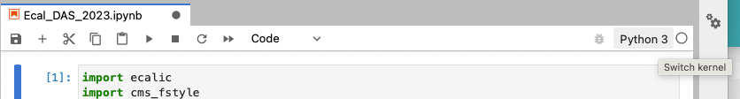

# ECAL @ PODAS2023 - tutorial

## Overview

In this tutorial we will go through several aspects that were cover during the course 
[ECAL](https://indico.desy.de/event/38207/contributions/152448/):
- Estimation of the noise in GeV from the pedestal measurement in ADC count. 
This involves the conversion from ADC to GeV which includes several important quantities specific to ECAL 
(laser transparency, alpha, intercalibration constant).
- Create a random InterCalibration `IC` file to decalibrate ECAL (random gaussian smearing + response shift alon $\eta$)
- Re-cover the injected $\eta$-scale from $Z\to e^+e^-$ events using standard ECAL tools. 


## Getting started

In order to setup the Ecal DPG exercise, you can follow the steps:
1. login in your Desy naf account ```ssh <login>@naf-cms.desy.de```
2. clone the ecal-das package from git and run the `setup.sh` script which activate the `ecal-das` virtual environment 
 and create a corresponding notebook kernel.
```commandline
git clone https://gitlab.cern.ch/cms-podas23/dpg/ecal-das.git
cd ecal-das
source setup.sh
```
3. log in the DESY jupyter hub and create a server (prefer a jupyter one rather than classical notebook) 
[NAF jupyter hub](https://naf-jhub.desy.de/)
   1. click the `ecal-das` repertory
   2. open the notebook `ECAL_DAS_2023`
   3. change the kernel from `Python 3` to `ecal-das` (click the top right corner to select a new kernel)




4. You are ready do start the tutorial
   TIP: to execute a cell in a notebook `shift+enter`

## Tutorial
Everything is explained directly in the notebook. In several places some cells have question with the mention 
**[YOUR TURN]** which means that you should try to find a solution. 
A potential solution is usually given in the cell right after the question.
At some point you will need to compute the $\eta$-scale using Ecal tools, in this case, 
you can do it directly in the NAF Linux window you logged in. 
